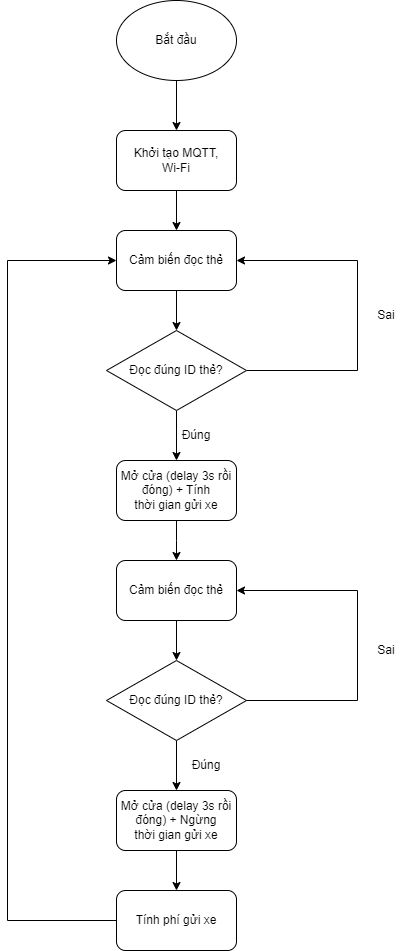
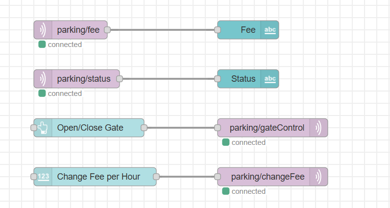

# Đề tài cuối kỳ Phát triển ứng dụng IoT: Hệ thống bãi đỗ xe thông minh

## Ý tưởng
Trong bối cảnh đô thị ngày càng phát triển, nhu cầu về các giải pháp thông minh để quản lý giao thông và tối ưu hóa việc sử dụng tài nguyên ngày càng trở nên cấp thiết. Một trong những vấn đề nổi bật trong các khu vực đô thị lớn là tình trạng tắc nghẽn giao thông do thiếu không gian đỗ xe hợp lý. Với sự gia tăng nhanh chóng về số lượng phương tiện cá nhân, đặc biệt là xe ô tô, việc tìm kiếm và quản lý bãi đỗ xe trở thành một thách thức không nhỏ đối với các cơ quan quản lý.

Truyền thống quản lý bãi đỗ xe tại các khu đô thị chủ yếu dựa vào phương thức thủ công, gây ra nhiều vấn đề như việc không theo dõi được tình trạng đỗ xe một cách hiệu quả, không tính toán được phí một cách tự động và dễ xảy ra tình trạng gian lận trong việc thanh toán. Thêm vào đó, các bãi đỗ xe hiện nay phần lớn chưa ứng dụng công nghệ hiện đại để cải thiện hiệu quả quản lý và sử dụng không gian.

Để giải quyết các vấn đề này, dự án "Hệ thống bãi đỗ xe thông minh" trong đề tài này giúp tự động hóa các công đoạn quản lý như kiểm tra tình trạng đỗ xe, tính phí và điều khiển hệ thống mở/đóng cửa thông qua thẻ RFID và động cơ servo. Đồng thời, có thể điều chỉnh mức phí đỗ xe và cửa đóng/mở thủ công từ xa qua giao diện Dashboard Node-RED.

## Phần cứng sử dụng
* ESP32 Devkit v1
* Module RFID RC522
* LED (Xanh + Đỏ)
* Động cơ servo

## Sơ đồ khối

## Flow Node-RED

## Kết nối MQTT
Sử dụng sever MQTT trên cloud của HiveMQ

